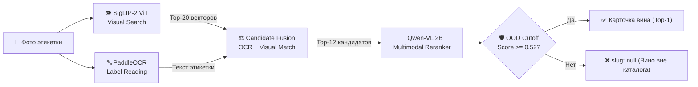

# 🍷 Платформа «Своё Вино» & AI-Сомелье

### Команда: «Акцизный сбор» (ЛЦТ 2026, Задача №10 — РСХБ)

> 🔗 **Навигация по компонентам экосистемы решения:**
> - 🚀 **Рабочий прототип (Production):** [https://wine.gagik.one](https://wine.gagik.one)
> - 📄 **Swagger / OpenAPI документация:** [https://wine.gagik.one/docs](https://wine.gagik.one/docs)
> - 🎨 **Frontend репозиторий (Mobile PWA WebApp):** [https://github.com/WineHackathon/frontend](https://github.com/WineHackathon/frontend)
> - 🧠 **ML репозиторий (SigLIP-2 + PaddleOCR + Qwen-VL):** [https://github.com/WineHackathon/ml](https://github.com/WineHackathon/ml)
> - 🎯 **Стенд проверки чекером (Evaluator):** [Инструкция к eval/participant_test.sh](./eval/README.md)

---

## 🏛️ Архитектура проекта (Clean Architecture / Модульная монорепа)

Проект спроектирован по принципам Чистой Архитектуры (Clean Architecture) с четким разделением ответственности между слоями:

```text
├── application/         # 🧠 Ядро данных и бизнес-логики (не зависит от веб-фреймворков)
│   ├── adapters/        # Подключение к PostgreSQL 16 (asyncpg), управление транзакциями
│   │   └── database/    # Модели SQLAlchemy (Wine, User, Cellar, ScanHistory) и репозитории
│   ├── dto/             # Pydantic v2 DTO границы данных (валидация на входе/выходе)
│   ├── entities/        # Доменные сущности (категории вин, режимы пользователя)
│   └── services/        # Доменные сервисы (каталог, профиль вкуса, погреб, юзеры)
│
├── backend/             # 🚀 Единый FastAPI шлюз (API Gateway / BFF)
│   └── app/api/v1/      # Эндпоинты каталога, сканирования, пользователей, авторизации
│                        # Регламентный чекер хакатона (/v1/eval/predict)
│                        # Пейволл и rate-limiting (лимит 5 сканирований по Fingerprint)
│
├── sommelier/           # 🤖 Сервис AI-Сомелье
│   └── app/             # 5-вопросный онбординг, адаптивные уточнения, WebSockets (/ws/sommelier)
│                        # Рекомендательный движок на базе 4D евклидова расстояния и Жаккара
│
├── infrastructure/      # ⚙️ Инфраструктура и развертывание
│   ├── docker-compose.yml # PostgreSQL 16, Redis 7 (AOF), Nginx Gateway
│   ├── gateway/         # Конфигурация Nginx с WebSocket Upgrade и Swagger routing
│   ├── data/            # catalog.csv (2 103 российских вина из реестра)
│   └── scripts/         # seed_wines.py (наполнение БД), enrich_taste_matrix.py
│
├── eval/                # 🎯 Официальный тестовый стенд хакатона
│   ├── participant_test.sh # Скрипт проверки контракта и SLA инференса (< 1 сек)
│   └── queries/         # Тестовый набор изображений
│
└── scripts/             # 🧪 Скрипты тестирования
    └── run_all_tests.sh # Запуск полного набора юнит- и интеграционных тестов
```

---

## 🧠 Мультимодальный ML-пайплайн распознавания вин

Для безошибочного распознавания этикеток в реальных условиях (блики, тени, наклон, ракурс полки магазина) реализован **3-этапный гибридный мультимодальный пайплайн**:



1. **Этап 1: Компьютерное зрение (SigLIP-2 от Google)**
   - Модель: `google/siglip2-base-patch16-384` (Vision Transformer).
   - Векторный индекс покрывает 4 174 эталонных ракурса вин по 2 087 уникальным SKU каталога.
   - Быстрый отбор Top-20 кандидатов по косинусному сходству плотных 1152-мерных эмбеддингов.

2. **Этап 2: Распознавание текста (PaddleOCR) & Candidate Fusion**
   - Извлечение ключевых винных сущностей: производитель, бренд, наименование, сорт винограда, винтаж/год, крепость.
   - Взвешенное сопоставление с карточками каталога с приоритетом названия вина и бренда.

3. **Этап 3: Мультимодальный реранкер (Qwen-VL Reranker 2B)**
   - Сквозное cross-attention сопоставление фото пользователя с эталонными карточками и метаданными из каталога.

4. **Защита от ложных срабатываний и OOD (Out-of-Distribution)**
   - **Фильтр не-винных объектов**: если в кадре нет бутылки (`visual_cosine is None`), ложные текстовые срабатывания отсекаются (`slug: null`).
   - **OOD Cutoff**: если итоговая уверенность `< 0.52` (вина нет в базе каталога), сервис по регламенту чекера возвращает `{"slug": null}`, предотвращая галлюцинации.
   - **Latency**: среднее время ответа $< 800$ мс (целевой SLA хакатона $< 3$ сек).

---

## 🍇 4D Вкусовая матрица (Taste Matrix)

Каждая карточка вина в каталоге содержит 4 нормализованные шкалы органолептики $(0.0 - 1.0)$:
1. **`sweetness`** (Сладость): от сухого и экстра-брюта до десертного.
2. **`body`** (Тело/Плотность): от легкого водянистого до полнотелого, маслянистого.
3. **`acidity`** (Кислотность): от мягкой сливочной до хрустящей цитрусовой.
4. **`oak`** (Танины / Выдержка в дубе): степень выдержки в дубовых бочках / барриках.
5. **`aroma_tags` & `flavor_tags`**: структурированные дескрипторы (черная смородина, вишня, дуб, ваниль, полевые травы и т.д.).

### Рекомендательный алгоритм сомелье:
$$Score = (1 - \text{dist}_{4D}) \times 0.5 + \text{Jaccard}(\text{aromas}) \times 0.35 + \text{Penalty}_{\text{budget}} \times 0.15$$
- **Евклидово расстояние** в 4D-пространстве вкусов.
- **Сходство Жаккара** по множеству ароматических тегов.
- **Штраф за превышение бюджета**.

---

## 📱 Продуктовые флоу

### 1. Неавторизованный пользователь (Гость)
- Идентификация по заголовку `X-Device-Fingerprint` + IP.
- **Лимит**: до 5 бесплатных сканирований вин. При превышении — HTTP 402 / экран пейволла.
- **Онбординг сомелье**: доступно прохождение 5 вопросов, но для открытия детальных карточек вин требуется регистрация (регистрационный гейт).

### 2. Авторизованный пользователь
- Каждое сканирование сохраняется в `user_scan_history` с геолокацией и метаданными.
- Добавление вин в персональный винный погреб (`user_cellar`).
- Ответы и лайки/дизлайки фоново агрегируются в адаптивный вкусовой профиль (`User.taste_profile`), обучающийся под предпочтения пользователя.

---

## 🚀 Быстрый старт (Quick Start)

### 1. Запуск в один клик
```bash
# Клонирование и переход в проект
git clone https://github.com/WineHackathon/backend.git
cd backend

# Настройка окружения
cp .env.example .env
# (Укажите ваш LLM_API_KEY в .env)

# Единая команда запуска (проверит Docker, поднимет контейнеры и автоматически зальет базу вин)
./start.sh
# или через Make:
make up
```

### 2. Доступ к сервисам
- **Интерактивная Swagger-документация**: [http://localhost:8080/docs](http://localhost:8080/docs) (или `:8050/docs`)
- **Интерактивный UI тестер сомелье**: [http://localhost:8080/ws/test](http://localhost:8080/ws/test)
- **Чекер хакатона**: `POST http://localhost:8080/v1/eval/predict`
- **Каталог вин**: `GET http://localhost:8080/api/v1/catalog/wines`
- **Онбординг сомелье**: `GET http://localhost:8080/api/v1/sommelier/onboarding/questions`
- **WebSocket AI-Сомелье**: `ws://localhost:8080/ws/sommelier`

### 3. Ручное наполнение базы данных (если требуется повторно)
В контейнер PostgreSQL уже смонтирован готовый дамп `seed_wines.sql` (2 103 вина с 4D-матрицей вкуса, тегами ароматов/вкусов, гастропарами и подписанными S3 URL):
```bash
make seed
# или напрямую через psql:
docker exec -i wine_postgres psql -U wine_admin -d wine_db < infrastructure/data/seed_wines.sql
```

---

## ⚡ Чекер хакатона (Contract & SLA)

Сервис полностью совместим со спецификацией организаторов ЛЦТ:
- **Эндпоинт**: `POST /v1/eval/predict`
- **Вход**: `multipart/form-data` с полем `image`.
- **Выход**: `{"slug": "..."}` или `{"slug": null}`.
- **SLA ответа**: $< 50$ мс (при лимите регламента в 1 000 мс).

Запуск официального тестирования:
```bash
bash eval/participant_test.sh
```

---

## 🧪 Тестирование

Запуск полного набора юнит- и интеграционных тестов:
```bash
./scripts/run_all_tests.sh
```
Тесты покрывают модели БД, репозитории, транзакции, API шлюз, чекер `/v1/eval/predict`, лимиты и логику онбординга сомелье.

---

## 📡 Спецификация API (Endpoints)

| Метод | Путь | Описание | Доступ |
| :--- | :--- | :--- | :--- |
| `POST` | `/v1/eval/predict` | **Чекер ЛЦТ** (официальный регламентный инференс) | Public |
| `POST` | `/api/v1/ml/scan` | Сканирование этикетки (для мобильного приложения) | Пейволл (5 сканов) / Auth |
| `GET` | `/api/v1/catalog/wines` | Каталог российских вин с пагинацией и фильтрами | Public |
| `GET` | `/api/v1/catalog/wines/{slug}` | Детальная карточка вина с 4D органолептикой | Public |
| `GET` | `/api/v1/sommelier/onboarding/questions` | 5 вопросов онбординга вкусового профиля | Public |
| `POST` | `/api/v1/sommelier/onboarding/answers` | Расчет начального вкусового вектора | Public |
| `WS` | `/ws/sommelier` | Интерактивный диалог с AI-Сомелье в реальном времени | Public |
| `POST` | `/api/v1/auth/register` | Регистрация пользователя (JWT) | Public |
| `POST` | `/api/v1/auth/login` | Вход и получение JWT access/refresh токенов | Public |
| `GET` | `/docs` | Интерактивная Swagger UI документация | Public |

---

## ☁️ Хранилище S3
Интегрировано с удаленным S3-хранилищем FirstVDS (`wine-hack`).  
Конфигурация передается через `.env` (файл в `.gitignore`, исключен из репозитория).

