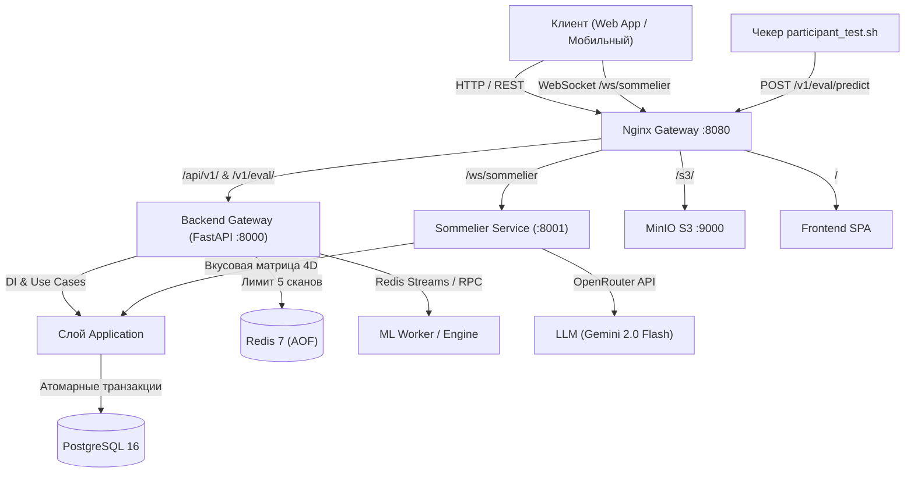

# Архитектура платформы «Своё Вино» & AI-Сомелье

Платформа цифрового распознавания винных этикеток и интеллектуального подбора вин на основе вкусовой матрицы, разработанная для Международного хакатона ЛЦТ 2026.

---

## 🏛 1. Концепция модульного монорепозитория

Проект спроектирован по стандарту **Clean Architecture** и **Domain-Driven Design (DDD)** в форме модульного монорепозитория. Это обеспечивает максимальное соответствие критерию хакатона **«Архитектура (15/100) — качество разделения функционала внутри репозитория, воспроизводимость»**.

### Структура слоев:

```
├── application/       # Слой данных, моделей, репозиториев, транзакций и прикладных сервисов
├── backend/           # Единый входной шлюз FastAPI (API Gateway / BFF)
├── ml/                # Выделенный ML-слой (векторный поиск, эмбеддинги, Redis Stream воркер)
├── sommelier/         # Сервис AI-сомелье (5-вопросный онбординг, подбор по вкусовой матрице, WebSocket)
├── infrastructure/    # Оркестрация (Docker Compose, Nginx Gateway, скрипты разметки)
├── frontend/          # Веб-приложение со сканером камеры и чатом
└── docs/              # Архитектурная документация и ADR
```

---

## 📊 2. Диаграмма взаимодействия компонентов



---

## 🍇 3. Вкусовая матрица вина (Taste Matrix)

Сущность вина расширена 7 ключевыми органолептическими признаками:
1. `sweetness` (1.0 — экстра-сухое, 5.0 — десертное).
2. `body` (1.0 — лёгкое, 5.0 — мощное/полнотелое).
3. `acidity` (1.0 — мягкая, 5.0 — хрустящая/высокая).
4. `oak` (1.0 — без дуба/сталь, 5.0 — глубокая выдержка в дубе/барриках).
5. `aroma_tags` (JSONB-массив: вишня, черная смородина, ваниль, полевые травы и др.).
6. `flavor_tags` (JSONB-массив: слива, табак, шоколад, минералы и др.).
7. `derived_attributes_confidence` (уверенность извлечения от 0.0 до 1.0).

### Алгоритм сопоставления (Recommendation Engine):
Поиск вин осуществляется в 4D-пространстве вкуса с минимизацией взвешенного евклидова расстояния и максимизацией сходства дескрипторов по коэффициенту Жаккара:
\[
\text{Distance} = \sqrt{1.5(s - s_0)^2 + (b - b_0)^2 + (a - a_0)^2 + (o - o_0)^2} - 1.5 \cdot \frac{|A_{\text{target}} \cap A_{\text{wine}}|}{|A_{\text{target}} \cup A_{\text{wine}}|}
\]

---

## 🔄 4. Продуктовые флоу

### А. Неавторизованный пользователь (Гость)
1. **Сканирование этикеток (`POST /api/v1/ml/scan`)**:
   - Защита по `X-Device-Fingerprint` + IP-адресу через атомарный счетчик Redis `anon:scan:{id}`.
   - Пользователь имеет право на **5 бесплатных сканирований**.
   - На 6-е сканирование возвращается `registration_required: true` с предложением зарегистрироваться.
2. **Диалог с сомелье (`/ws/sommelier` или HTTP)**:
   - Пользователь может пройти опрос из 5 вопросов онбординга.
   - Для получения полных карточек вин и сохранения в личный погреб выдается предложение авторизации.

### Б. Авторизованный пользователь
1. **История сканирований**:
   - Каждое сканирование сохраняется в `user_scan_history` с привязкой к `user_id`.
2. **Оптимальный первый диалог онбординга**:
   - 5 базовых вопросов:
     1. Цвет/Тип (Белое, красное, розовое, игристое).
     2. Сладость (Сухое или с остаточной сладостью).
     3. Плотность/Тело (Лёгкое, среднее или плотное).
     4. Кислотность/Свежесть (Больше свежести или мягкости).
     5. Ароматы (Ягоды, цитрусы, дуб/пряности, минералы).
   - **Адаптивные ветвления**:
     - При выборе красного -> уточнение дуба и плотности.
     - При выборе белого -> уточнение кислотности и минеральности.
     - При запросе необычного -> предложение автохтонных сортов (Кокур, Красностоп, Цимлянский черный).
3. **Фоновая агрегация вкусового профиля (`taste_profile`)**:
   - В фоне (без блокировки UI) сырые ответы сохраняются в `user_preference_history`.
   - Вкусовой профиль пользователя `User.taste_profile` пересчитывается по формуле экспоненциального скользящего среднего (EMA, \(\alpha = 0.35\)).

---

## ⚡ 5. Инфраструктура и воспроизводимость

Вся система поднимается одной командой:
```bash
docker compose -f infrastructure/docker-compose.yml up --build
```
Все тесты запускаются детерминированно:
```bash
./scripts/run_all_tests.sh
```
Чекер хакатона тестируется через:
```bash
cd eval && bash participant_test.sh
```
